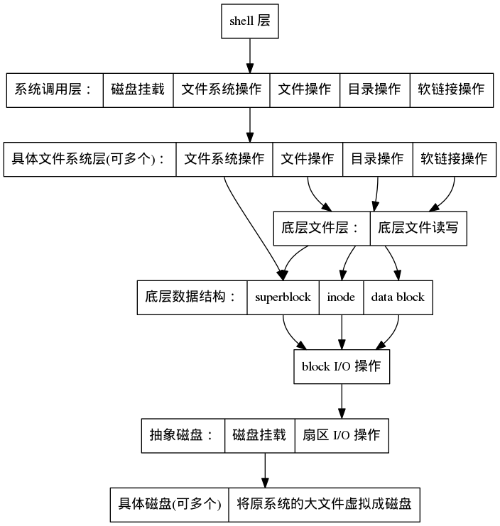

> 本文档于课程设计时（2016年12月）撰写，于2020年3月在电脑上发现整理，不仅怀念起当时的时光。

# 设计任务，要求

# 程序设计目标

## 程序全局设计目标

  经过小组讨论，实际的程序的功能设计除课程设计的要求之外，还额外的增加了一些必要且实用功能和设计。
  一来使得整个程序的的设计结构更加模块化，更富有弹性和扩展性，还能提供友好的操作方式；
  二来通过这些额外设计增进小组对操作系统和编程的理解和能力。

总的来说，程序在设计之初，规划中的功能有：

一、程序能够在多种抽象磁盘上建立文件系统。其中，抽象磁盘可以是：

- 真正的磁盘
- 主操作系统中的一个大文件
  但是实际上，任何能够看成一系列扇区组合的并且支持对某个扇区进行读写操作的对象，都能视为抽象磁盘，从而基于此建构整个文件系统。

二、程序能够将不同的磁盘挂载到不同盘符（类似 Windows 系统的盘符），在通过路径操作文件时，程序能自动根据盘符识别具体的文件系统类型，从而执行对应的操作。
一个磁盘可以格式化为一个文件系统，一个磁盘可以挂载到一个盘符。理论上，程序支持多种文件系统，如：

- FAT32
- ext3
- ext4
- fulfs

由于此课程设计的目标是实现类 unix 文件系统（在这次课程设计里将其命名为 fulfs），因此实际上只实现了 fulfs。
但是理论上能够进行方便的扩展支持其它的各种文件系统。

三、由于第 2 点的设计需要，程序必须提供一组抽象的接口用于根据文件路径来操作文件系统而不用关心文件系统的具体类型。
因此，程序封装了一组接口，并且为了对使用者友好，其接口形式尽量模仿了 linux 系统调用。

四、程序提供了一个 shell 用于操作挂载的文件系统。并且为了提供良好的用户体验，shell 的绝大数命令都是仿照 linux 的形式。包括以下命令：

- cd 切换当前目录。
- pwd 输出当前目录。
- ls 列出目录中的文件。
- rmdir 删除空目录。
- mkdir 创建目录。
- ln 创建链接，支持硬链接和符号链接。
- rm 删除文件。
- cp 复制文件。
- mv 移动文件。
- stat 输出文件的信息。
- df 输出挂载的文件系统的信息。

五、目前整个程序的实现用到且只用到了 ANSI C 和其标准库：

- 不涉及任何 windows 或 linux 系统调用或其它依赖于具体操作系统的库
- 不涉及任何第三方库
- 涉及到的算法和数据结构全部由小组编码完成
- 理论上，能够跨平台执行，包括 Windows 和 linux.

## fulfs 文件系统设计目标

fulfs 是小组独立实现的并且符合题目要求的文件系统，为了方便代码编写，将其命名为 fulfs。fulfs 的总体设计目标如下：

- 底层上：
  
  - 采用索引节点储存文件系统。根据课本的解释，索引节点储存另外文件控制块 FCB 中除文件名之外的内容。
  - 采用混合分配方式组织文件数据。
  - 采用成组链接法管理空闲的数据块。

- 功能上：
  
  - 对最基本的文件储存的支持。
  - 对文件，即能够将文件当成流来读写，也能够对文件进行随机读写。
  - 对路径和目录的完整支持。
  - 对硬链接的完整支持。
  - 对符号链接的支持。

# 原理以及算法描述

## 程序整体设计图



## fulfs 文件系统整体格式

首先，整个磁盘是以 盘块（block） 为单位进行划分的。将整个磁盘每 sectors_per_block 个扇区分为一组，称为盘块（block）。
整个文件系统的数据结构和算法都是以盘块为单位进行操作，读写的。

block 的大小是扇区大小的整数倍。一个 block 常用 1K，2K，4K，8K。
block 从 0 开始编号，最大到 2^32 - 1，为 uint32_t 的最大值。

假设 block 为 1K，理论上，可管理的最大磁盘容量达到 4T。


在磁盘的布局上，如图所示，整个磁盘被划分成了三个部分。分别是：
`superblock`：超级块存放文件系统的全局控制信息。如文件系统的 block 大小相关信息，文件系统总扇区数，根目录 inode 号等一些文件系统全局的信息。
考虑到在最开始是不知道 block 的大小的，因此为了实现方便，superblock 始终占用第 0 号 block，但是其真正储存数据只限于第 0 号扇区。

`Inode table`: 这个区域里每个 block 存放可最多存放的整数个 inode 节点。
由于 inode 节点编号是两位无符号整型数，因此理论上 inode 编号最大到 2^16 - 1，是 uint16_t 的最大值。
由此可知，fulfs 文件系统能够储存的目录和文件的总和是有限的。

`Data blocks`: 存放文件内容的空间。当文件需要储存具体的数据时，会从这里划分出一块空闲盘块，并且自己组织管理。

## 文件和目录管理

普通文件和目录甚至符号链接在此文件系统底层都统一视为文件。
inode 节点中储存一个字段 mode 来表示此文件在上层表现为普通文件，目录，还是符号链接。
除此之外，为了实现方便，inode 空闲管理采用比较低效的方式。
mode 字段还被用来标记是否是空闲块，申请空闲块时需要遍历所有的 inode 节点以寻找空闲块。

除此之外，inode 节点还记录了文件的创建时间，最后访问时间，最后修改时间等信息，保存了丰富的文件信息。

由于此文件系统使用混合分配方式组织文件数据，因此 inode 节点中，提供 10 个直接索引，1 个一级索引，1 个二级索引，1 个三级索引。
当低级的索引满后，启用高一级的索引。

对于数据盘块（data block）的空闲管理，此文件系统使用成组链接法管理数据盘块分配和回收。具体的数据结构实现在后面的重要算法中叙述。

## 多磁盘挂载

程序采用类似 Windows 盘符的设计，支持将一个磁盘上的文件系统挂载到某个盘符上。
之后，盘符路径即为此文件系统的根目录。
程序内部会记录盘符对应的文件系统信息，比如磁盘号，文件系统类型等。

如设计图所示，在模拟系统调用那一层，操作函数所接收到的路径是带有盘符信息的。
首先这层的操作函数抽取出路径的盘符部分，找到对应的磁盘号和文件系统类型。
之后，抽取出路径中不带盘符的部分，根据文件系统类型找到该文件系统具体的处理函数，调用之以执行对应操作。

# 开发环境

- 操作系统环境：Debian GNU/Linux 8.6 (jessie)，armv7l，2G RAM
- 编译器环境：gcc version 4.9.2 (Debian 4.9.2-10)
- 调试器：GNU gdb (Debian 7.7.1+dfsg-5) 7.7.1
- make 工具：cmake version 3.0.2，GNU Make 4.0
- 版本控制：git version 2.1.4

注：由于整个程序用且仅用了 ANSI C 和其标准库，因此虽然是用 linux 开发环境，但是也能无缝在 Windows 下编译执行。

# 重要算法和设计思路描述

  在整个程序的实现中，涉及的几个关键而且重要的算法分别为混合分配方式中第 n 个相对盘块的定位与添加盘块以及删除盘块，
  成组链接法中数据结构的实现和对应的盘块分配/回收算法，
  对多个文件名引用的正确处理（此文件系统支持硬链接），以及根据文件的绝对路径定位文件的 inode 编号。

下面逐个阐述这些关键算法和其设计思路。

### 1. 文件中第 n 个相对盘块的定位

文件中第 n 个相对盘块是指将文件储存数据的盘块从 0 开始编号，编号为 n 的盘块。
假设盘块编号是 64 位的无符号整数，位数记为 `sizeof(block_no_t)`, 每盘块大小记为 `block_size`，且是 2 的整数次方。
那么，在一个间接盘块中可记录的盘块号数为：`block_size / sizeof(block_no_t)`

这样，可知：
直接索引中能储存的数据大小为：`count_0 = block_size * 10`
一级索引中能储存的数据大小为：`count_1 = (block_size / sizeof(block_no_t)) * block_size`
二级索引中能储存的数据大小为：`count_2 = (block_size / sizeof(block_no_t)) * (block_size / sizeof(block_no_t)) * block_size`
三级索引中能储存的数据大小为：`count_3 = (block_size / sizeof(block_no_t)) * (block_size / sizeof(block_no_t)) * (block_size / sizeof(block_no_t)) * block_size`

由于 inode 中记录了文件的数据大小，因此通过比较，就能知道第 n 个盘块位于第几级索引上。

以三级索引为例，三级索引的具体结构很像一颗树。
三级索引中的第一层块里记录了一组第二层块盘块号，每个第二层块里记录了一组第三层块盘块号，每个第三层块里记录了一组数据块盘块号（称为第四层）。
将第一层块从 0 开始编号称为第一层相对块号，将第二层块从 0 开始编号称为第二层相对块号，以此类推。。。

通过简单的计算可知，第 n 个相对盘块对应储存数据的三级索引第四层块的第四层相对块号为 `m = n - count_0 - count_1 - count2`。

之后，可知，第 m 个相对盘块在上层的第 `m / ((block_size / sizeof(block_no_t))` 个第三层盘块里，
并且偏移量为 `m % ((block_size / sizeof(block_no_t))`

现在，只需要定位出第三层的相应块，就能读取出第四层的对应的第四层相对块号的盘块号。
按照类似的计算方法，定位出第三层的相应块需要定位出第二层的某一块。。。。
因此，整个算法是，是个递归算法。

## 2. 文件中储存数据的盘块的增加与删除

这个算法是与上一个算法有很多类似的地方，相同的地方不再叙述。
总体上需要注意到地方是：
对增加盘块来说，判断增加盘块是否需要启用新等级的索引，两种情况需要分别处理。
对删除盘块来说，判断删除盘块后是否会降低最大的索引等级，两种情况也需要分开处理。

算法首先定位到最后一个盘块。
对增加盘块来说，判断是否需要添加新的上层盘块，若是，则递归添加上层盘块。之后分配新的盘块。
对删除盘块来说，判断删除后是否上层盘块为空，若是，回收旧盘块，之后递归删除上层盘块。

## 3. 成组链接法的盘块分配和回收

最初在磁盘上建立文件系统时（格式化），需要将划分为数据盘块的区域组织成成组链接法中的数据结构。

这种数据结构的整体结构是将，空闲块分成若干组（比如每组 100 个），之间用类似链表的数据结构串起来。
在每组内部，是最大大小为 100 的栈。
总体上，整个混合的数据结构表现为一个抽象的大栈，分配空闲块即弹栈，释放空闲块即压栈。

首先，这种数据结构拥有类似链表一样的一个首个盘块指针指向某个盘块。
这个盘块里，储存了第一组空闲的盘块号和本组的栈顶指针。
在栈底，最后一个空闲盘块号指向了的空闲盘块中，储存了下一组的空闲盘块号。
以此类推，最后一组盘块中，栈底的盘块指向 0，表示整个数据结构到此终止。

分配盘块时，首先根据首个盘块指针找到第一组空闲盘块，从其中弹出一个空闲盘块。
假如弹出是最后一个盘块号，则将最后一个盘块号指向的盘块的内容复制到首个盘块指针指向的盘块中。

回收盘块中，首先根据首个盘块指针找到第一组空闲盘块，
假如第一组空闲盘块已经满了，就把这些空闲盘也即首个盘块指针指向的盘块内容复制到回收盘块中，
然后将首先盘块指针指向的盘块内容清空，并向其中压入回收盘块的盘块号。

## 4. 对硬链接的正确处理

由于此文件系统是使用 inode 节点，文件名和 inode 是分开储存的，因此可以将多个文件名对应到同一个 inode 上，也即同一个文件上。
所以此文件系统能很方便的实现硬链接。

首先 inode 中要记录一个字段，类似引用计数，表示此文件有几份文件名引用。
当创建文件时，引用计数默认为 1.
当创建硬链接时，对应文件的引用计数加 1.
当文件名被删除时引用计数减一。当引用计数减小到 0 时，表示没有文件名指向此文件，文件会被真正的删除。

## 5. 根据文件的绝对路径定位文件的 inode

在底层，目录也被视为一个文件。
其中储存的数据是一组目录项，每条目录索引储存 14 字节的文件名和 2 字节的文件 inode 编号。

首先，定位出根目录，从路径中抽取出一级子目录。从根目录中找到一级子目录，定位出其 inode 编号。
之后，打开一级子目录，从路径中抽取出二级子目录，从一级子目录中查找出二级子目录的 inode 编号。
以此类推，最终定位到最终的文件 inode 编号。

# 程序实现 --- 数据结构

fulfs 文件系统设计到的数据结构有：suprblock，磁盘 inode，内存 inode，目录项，成组链接法中的某一组。

superblcok 的数据结构，位于 fulfs/suprblock.h:

```c
typedef struct {
    uint16_t sectors_per_block; /* 每个 block 占的扇区数 */
    sector_no_t sectors; /* 总的扇区数 */
    uint64_t total_size; /* 文件系统总大小 */
    // uint64_t used_size; /* 被使用的大小 */
    inode_no_t root_dir; /* 指向根目录的 inode */
    block_no_t inode_table_block; /* inode table 起始的 block 号 */
    inode_no_t inode_total_count; /* inode table 区总 inode 个数 */
    block_no_t data_block; /* data 区的起始 block 号 */
    block_no_t data_block_free_stack; /* data block 的空闲管理相关 */

    inode_no_t used_inode_count; /* 已经使用的 inode 节点个数 注：在 base_file 层，删除文件减 1，创建文件加 1 */
    block_no_t used_data_block_count; /* 已经使用的 data block 块个数  注：在 base_block_file 层负责维护此变量 */

}superblock_t;
```

磁盘 inode 的数据结构，位于 fulfs/inode.h:

```c
#define LEVEL_0_INDIRECT_COUNT 10
typedef struct
{
    uint16_t mode;
    uint16_t link_count;
    uint64_t size;
    block_no_t blocks[LEVEL_0_INDIRECT_COUNT];
    block_no_t single_indirect_block;
    block_no_t double_indirect_block;
    block_no_t triple_indirect_block;
    timestamp_t accessed_time;
    timestamp_t modified_time;
    timestamp_t created_time;
}inode_t;

enum {
    MODE_EMPTY,
    MODE_FILE,
    MODE_DIR,
    MODE_SYMBOL_LINK
};
```

这个数据结构包含了内存 inode 节点，位于 fulfs/base_file.h:

```c
typedef struct {
    device_handle_t device;
    inode_no_t inode_no;
    inode_t inode;
    superblock_t* sb;

    /* 储存内部指针的底层信息 */
    struct {
        block_no_t current_block_relative;
        int current_offset;
    }current;

}base_file_t;
```

目录项的数据结构，位于 fulfs/file_dir.c:

```c
#define DIR_ITEM_NAME_SIZE 14
#define DIR_ITEM_SIZE (DIR_ITEM_NAME_SIZE + sizeof(inode_no_t))

struct dir_item_s {
    char name[DIR_ITEM_NAME_SIZE + 1];
    block_no_t inode_no;
};
```

（注：此数据结构是储存在内存中的，实际磁盘中的目录项占 16 位。）

成组链接法中表示某一组的数据结构，位于 fulfs/data_block.h:

```c
#define MAX_GROUP_COUNT 100
struct group_s{
    uint8_t top;
    block_no_t free_block[MAX_GROUP_COUNT];
};
```

# 程序实现 --- 程序清单

## 代码结构

以下是代码结构其文件介绍：

```
.
├── CMakeLists.txt cmake 文件
├── main.c     程序的主入口
├── test.c     这里是一组测试，在开发时用来测试代码的正确性
├── shell.h    程序提供的模拟 shell 入口。    
├── shell.c
├── shell_command.c
├── shell_command.h   程序提供的模拟 shell 提供了一组模仿 linux 命令的命令，在这个模块里实现
├── fs.c
├── fs.h              这里对应设计图的模拟系统调用层。通过这个模块，即可无视文件系统类型操作文件
├── fs_def.h          这里定义了各种具体文件系统的实现和 fs.h 模块的约定接口
├── device_io.c
├── device_io.h       抽象磁盘。这里把一个大文件虚拟成一个磁盘，赋予一个磁盘号，并以扇区为单位进行读写
├── fulfs
│   ├── fulfs.h
│   ├── filesystem.c
│   ├── filesystem.h  对 fulfs 文件系统的操作，如格式化，查看总空闲和剩余空间等。
│   ├── file_dir.c
│   ├── file_dir.h    这里实现了 fulfs 文件系统的普通文件 I/O，目录操作，硬链接以及符号链接
│   ├── base_file.c   在 fulfs 底层，一切都视为以 inode 编号为标志的底层文件
│   ├── base_file.h
│   ├── base_block_file.c 把底层文件成是一个个的盘块组成，提供定位盘块，增加盘块，删除盘块等核心算法。
│   ├── base_block_file.h
│   ├── superblock.c
│   ├── superblock.h      superblock 数据结构的操作和封装。
│   ├── inode.c
│   ├── inode.h           inode 节点数据结构的操作
│   ├── data_block.c
│   ├── data_block.h      储存数据盘块区的操作，使用成组链接法的核心算法在此
│   ├── block.h           将抽象磁盘看成一个个 block 组成的块，以 block 为单位进行读写
│   └── def.h
├── memory
│   ├── alloc.c 
│   └── alloc.h            对动态内存分配的包装
├── datastruct
│   ├── string.c
│   └── string.h           字符串操作的辅助函数
└── utils
    ├── log.c
    ├── log.h           日志功能，方便调试
    ├── math.h          计算相关的小函数
    ├── path.c
    ├── path.h          处理路径的辅助函数
    ├── sys.c           有几个小函数，通过 ANSI C 标准库给原系统的文件加几个操作
    ├── sys.h
    ├── testtools.c
    └── testtools.h     测试工具
```

具体的代码参考相关附件。

## 代码编译以及执行方式

编译：

```shell
mkdir build
cd build
cmake ..
make
```

之后，目录中生成 main 文件，为可执行文件。

使用示例：
`./main create test.fs 32000000`
创建一个大小为 32000000 字节的 test.fs 的文件，之后会将此大文件模拟成磁盘供程序使用。

`./main format test.fs fulfs 2048`
对 test.fs 这个大文件虚拟成的磁盘进行格式化，格式化为 fulfs 文件系统，文件系统盘块大小为 2048.

`./main enter `
进入程序的 shell 以操作挂载的磁盘的文件系统。
其中，磁盘的挂载需要写入配置文件 config.txt，如：

```
A test.fs
B test2.fs
```

这表示，将 test.fs 这个磁盘挂载到盘符 A，将 test2.fs 这个磁盘挂载到盘符 B.
等进入 shell 后，可以使用前面介绍的命令操作文件系统，这些命令都是仿照 linux 命令格式设计的。

`./main help`
查看使用帮助。

# 总结

  通过此时操作系统课程设计，将本学期所学习的文件系统理论知识用于编码实践，
  通过动手从头开始设计，编码，测试，直到最终运行，对文件系统知识的体会更为深刻。
  这次课程设计小组的收获主要有：

1. 整个文件系统的整体知识掌握的更加牢固。
2. 通过亲自设计代码，思考并明白了为什么文件系统需要此设计而非彼设计的深层原因。
3. 通过回顾整体设计和代码设计，小组讨论分析各种实现方案的优劣，对文件系统相关模块的各种方式的适用特点的理解更加深入。
4. 通过亲自动手编程一个具有实用性的项目，编程技能和对问题的理解能力大大提高。
5. 对 C 语言的掌握和理解更加牢固，也理解了一些 C 语言的惯用法和技巧的深层原因。
6. 通过控制一个超过 1000 行的项目，对软件工程的一些如高内聚，低耦合等原则有了深入的体会。
7. 深刻体会到正确并熟练的掌握各种辅助工具如 cmake, git 能大大提高效率，事倍功半。

# 参考文献

1. 《操作系统》课本
2. 《现代操作系统 第三版》

3. 其它网络资料
